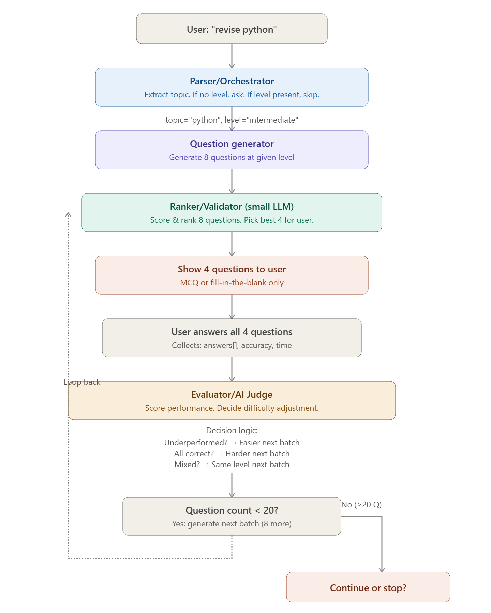

# Architecture — 4-Agent System

## Agents

### 1. Parser
- When: Once at start. Manages session state throughout.
- Purpose: Extract topic from natural input. If level not provided, ask for it.
- Input: "revise python" or "python intermediate" or "python decorators, i'm a beginner"
- Output: {topic: "python", level: "beginner" | "intermediate" | "advanced", session_id, question_count: 0, current_batch: 1}
- Logic: Use LLM to extract. Pattern match for level keywords. If ambiguous, reply "What's your level?"

### 2. Question Generator
- When: Once per batch (at start, then after each evaluation)
- Purpose: Create 8 questions tailored to the topic + current difficulty level
- Input: {topic, level, previous_answers[]}
- Output: [{q_id, question_text, options[], correct_answer, difficulty_estimate}] (8 questions)
- Note: Questions can only be MCQ or fill-in-the-blank

### 3. Ranker/Validator - (small LLM)

- When: Right after Question Generator
- Purpose: Score the 8 questions for relevance, difficulty calibration, quality. Pick the best 4.
- Input: {8 questions, stated_level}
- Output:

json  {
    "ranked_questions": [
      {"q_id": "...", "score": 9.2, "matches_level": true},
      ...
    ],
    "top_4": [q_id1, q_id2, q_id3, q_id4],
    "reason": "These 4 best match intermediate level, good coverage"
  }

- Logic: For each question, ask LLM: "Is this actually at intermediate level? Does it avoid ambiguity? Is it clear?" Score 1-10, pick top 4.


### 4. Evaluator/AI Judge
- When: After user answers all 4 questions
- Purpose: Score performance, decide difficulty for next batch
- Input:

json  {
    "user_answers": [
      {"q_id": "q1", "user_answer": "...", "correct_answer": "..."},
      ...
    ],
    "stated_level": "intermediate",
    "previous_questions": [...]
  }

- Output:

json  {
    "accuracy": 0.75,
    "assessment": "Mixed performance - some basics right, some advanced wrong",
    "next_level_adjustment": "same" | "easier" | "harder",
    "feedback": [
      {"q_id": "q1", "correct": true, "explanation": "..."},
      ...
    ]
  }

#### State schema (minimal)
```
python{
    "session_id": str,
    "topic": str,
    "stated_level": str,  # "beginner" | "intermediate" | "advanced"
    "question_count": int,  # Current count (0-20+)
    "current_batch": int,   # Which batch are we on (1, 2, 3, ...)
    
    "all_questions": [
        {
            "q_id": str,
            "question_text": str,
            "options": [str],  # For MCQ
            "correct_answer": str,
            "difficulty": float,  # 1-10 as evaluated by ranker
            "batch_num": int,
            "user_answer": str | null,
            "correct": bool | null
        }
    ],
    
    "session_stats": {
        "total_correct": int,
        "total_questions": int,
        "current_accuracy": float
    }
}

```

## State Flow



<!-- ## Key decisions
- Why merge Evaluator + Progress Monitor?
- Why adaptive staircase method (binary search for difficulty)?
- Why localStorage vs server-side session?
 -->
